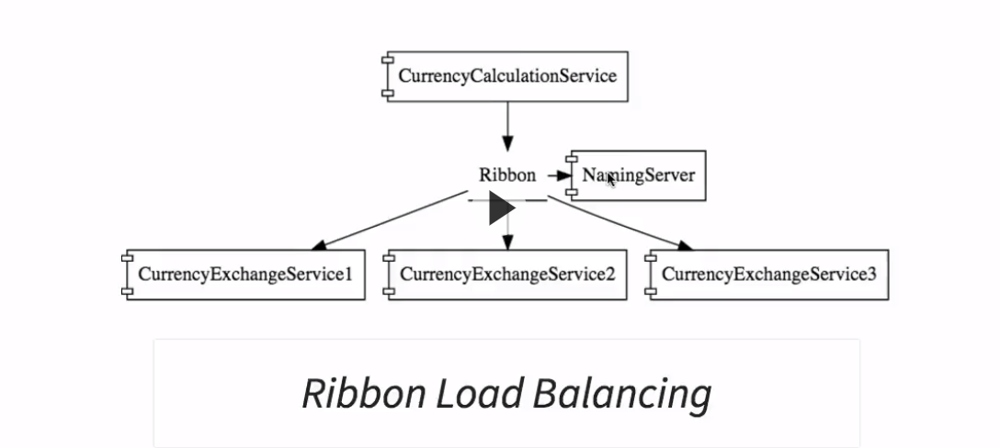
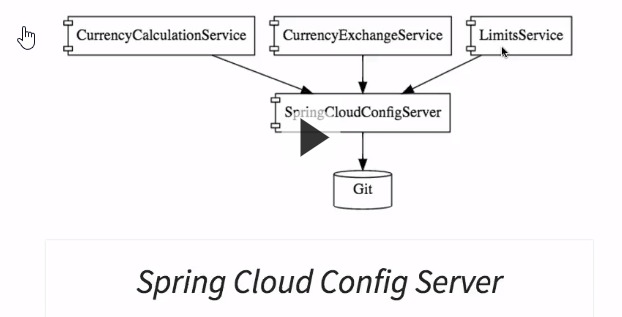
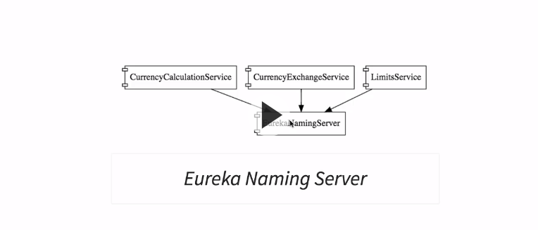
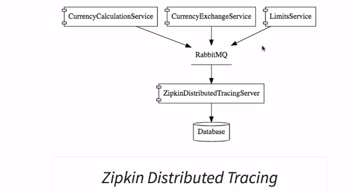

# Master Microservices with SpringBoot and SpringCloud
by: Ranga Karanam  (in28Minutes))

## Plan 
* Ch1 Intro
* Ch2 Introduction to Web Services (33m)
* Ch3 Restful Web Services with SpringBoot (222m)
* Ch4 Microservices with Spring Cloud (246m)
* Ch5 Appendix - Intro to SpringBoot in 10 steps (60m)
* Ch6 Appendix - Intro to JPA in 10 steps (60m)


## Ch5 Apendinx Intro do Spring boot in 10 steps

60 mins

github: https://github.com/in28minutes/spring-microservices/tree/master/01.framework-introductions/springboot-in-10-steps

concept of starter project, Embedded server (tomcat, Jetty  or Undertow)

spring boot provies:
*  metrics and health checks
* externalized configuration

Before Spring Boot:
Spring framework requires heavy configuration, version specifications
`WEB-INF/todo-servlet.xml`   with beans for every servlet
`WEB-INF/web.xml` dispatcher servlet, security, fiters, internalization, logging  etc... 

Spring Boot makes config easier and shorter 

### step3 using spring initializr to create a project
http://start.spring.io
choosen latest stable version 2.3.1 
group: com.ini28minutes.springboot.basics
artifact: springboot-in-10-steps
add spring Web dependency
**Generate** button
add this project  under t
**demo intellij project:** `~/repos/clearn/spring/in28micros/szi/msrv-parent`
with children modules
current  module is `springboot-in-10-steps`
Spring Boot app is running on default port 8080
e.g. `http://localhost:8080/books`
`BooksController` is a first bare rest service  with @RestController annotation

**AutoConfiguration** is a fundamental feature of Spring Boot.
to enable app debugging : _logging.level.org.springframework=DEBUG_  in  `src/main/resources.application.properties`

Spring framework 
https://spring.io

IOC : Inversion of Control
Spring solves a  problem of dependency injection.
Controllers are wired with Services
good integration with hibernate, mockito

Spring Boot radiacally simplifies the configuration of Spring app

Spring Boot Starter projects   built around well known patterns 

{spring-boot}:{starer-web, starter-test, starter-jdbc, starter-hateoas, starter-security, starter-data-jpa, starter-cache, starter-data-rest}
a lot of starter projects  docs.spring.io

#### Spring boot Actuator and hal-browser
add actuator dependecy in class 

http://localhost:8080/actuator/health

http://localhost:8080/browser/index.html#/  opens a browser for data mappings


## Ch6 Apendinx Intro do JPA in 10 steps
(60 mins)

### step4  using spring initializr to create a jpa project
http://start.spring.io
group: com.in28minutes.learning.jpa
dependencies: Web, JPA, H2
import generated project as module **jpa-in-10-steps**
**demo intellij project:** `~/repos/clearn/spring/in28micros/szi/msrv-parent/jpa-in-10-steps`
h2-console:  http://localhost:8080/h2-console
jdbc url:  jdbc:h2:mem:testdb

### step 5, 6 creating jpa entity User
`entity.User`
A bean with annotation   @Entity   
@Id  @GeneratedValue   e.g.  ensure that in DB schema this field is autoGenerated


A class to perform  lifecycle operations on entity is 

`service.UserDAOService`

@Repository, @PersistenceContext

@Transactional ensures db transaction support in operations, (commit, rollback)

@PersistenceContext    start tracking  entities in a PersistenceContext

`UserDaoServiceCommandLineRunner` is a class to insert some entities in db

has @Autowired  when the JpaIn10StepsApplication  is started this calss is ran. 

at http://localhost:8080/h2-console  you can see the 2 Users  rows inserted

Check 

https://github.com/in28minutes/spring-microservices/blob/master/01.framework-introductions/jpa-in-10-steps/notes.txt

in `pom.xml` there is a in-memory db dependency `com.h2database`

with  h2 in-memory db there is zero project setup. BUT data is not persistence between 2 spring boot app runs

`UserRepositoryCommandLineRunner`   `JpaRepository` is a common abstraction for data persistrence

Review steps  from

https://github.com/in28minutes/spring-microservices/blob/master/01.framework-introductions/jpa-in-10-steps/readme.md

## Ch2 Intro to Web Services

**WebServices**:

* designed  for machine-to-machine  or app - app interaction
* should be inter-operable (not platform dependent)
* should allow communication over network

Data can be exchanged in a interpretable way by:  XML, JSON, 
Every Web Service has service definition:

**demo intellij project module:** `~/repos/clearn/spring/in28micros/szi/msrv-parent/restful-web-services`

from step 30 

**demo intellij project module:** `~/repos/clearn/spring/in28micros/szi/msrv-parent/restful-web-services-jpa`

* request/response format
* request structure
* response structure
* endpoint

Transport Layer
* HTTP
* MQ   messages put in the queue, queue producer, queue consumer (queue bus)

#### Soap Web Service
Simple Object Access protocol. Defines a specific way to build services.  Uses XML request and XML request. Request/Reponse has Soap header and Soap Body
WSDL : web service definition language

Soap is a format of XML

#### RESTfull Web Service
Representational State Transfer

REst tries to use Http headers, methods (GET,PUT,POST,DELETE),  Http Statuses (200, 404,..)

key abraction: **Resource**
A resource  has a URI (Uniform Resource Identifier)

Data Exchange Format: no restriction, Json is popular
Rest transport : only HTTP
Service Definition: Not Standard, WADL /Swagger/

restfull services easier to implement then Soap

## Ch3 Restful Web Services with Spring Boot
(225 min)

step 10 ok 14:40 

on start.spring.io  created  `restful-web-services` maven project

List of services we shall created

* v get all users 	 			GET /users
* v  create a user	    		POST /users
* v  get a user       				GET /users/{id} -> /users/1
  delete a user				DELETE /users/{id} -> /users/1

get all posts for a user	 	GET /users/{id}/posts
create a post for a user		POST /users/{id}/posts
get details for a post 			POST /users/{id}/posts/{post_id}

created `HelloWorldBean` and mapped int in `HelloWorldController`

Debugging sprint app  ; in application.properties
```
logging.level.org.springframework = debug
```
dispatcher servlet 
JakconsAutoConfiguration

in springboot app debug log
```
Mapping servlets: dispatcherServlet urls=[/],
```
all requests go to DispatcherServlet

### Creating Rest services around User (with local storage)  
`user.User` , `user.UserDaoService`
`user.UserResource` contains path mappings

check  `requests.http`   file  for requests examples

Implement first POST request to create a user,   ensure that the  HTTP status returned is 201
`UserResource.createUser`

Implement first DELETE request to delete a user

For input validation check annotations on fields in `user.User` entity
Check class names in `javax.validation.constraints`

HATEOAS  (HyperText as the Engine of the Application State)
todo:  review Baeldung tutorial

#### internationalized input
```
GET http://localhost:8080/hello-world-internationalized
Accept-Language: fr
```

#### implementing support for XML
`jackson-dataformat-xml` dependency ensures  the  header `accept: application/xml` and xml support 

#### generation of Swagger dependencies
2 dependencies: springfox-swagger2 , springfox-swagger-ui

Swagger Annotations on Entity

#### monitoring api with actuator 

spring-data-rest-hal-browser  dependency

`http://localhost:8080/browser/index.html#/`
Hal Browser. Not for production

#### static filtering for Restful service

`filtering.FilteringController`

#### versionning of apis
`versionning.PersonVersionningController`

#### basic auth
`<artifactId>spring-boot-starter-security</artifactId>`
on spring boot restart
`Using generated security password: 6e9c1182-cf50-4eca-adc5-abda11ea1a22`

user and password can be set in the application properties 


#### step 29  Overview of connecting restful service to JPA
copied maven project: `restful-web-services`   to  `restful-web-services-jpa`

turn `user.User` to Entity


#### implement user Posts  entity and mapping

#### Richardson Maturity Model

level0, level1, level2, level3

* level1:  exposing resources with URI
* level2: level1 + proper user of http method
* level3: level2 + hateoas  (data + next possible actions)

##### best practices
* consumer first
* make great documentation of your api
* use GET,POST,PUT,DELETE methods
* use detailed  HTTP requests
* on secure info in URI
* use Plurals  `/users /users/1`
* use nounts
* use verbs sparringly
```
PUT /gists/{id}/star
DELETE /gists/{id}/star
```

## Ch4 Microservices with spring cloud

start 12:00 25.07

**Microservices**
* have some common management
* REST
* Small Well Chosen Deployable Units
* Cloud Enabled
* Require relatively little configuration

##### challenges
* bounded context, evolutionary exercice
* configuration management, many services
* scalability with dynamic load balancing
* visibility, centralized log
* monitoring around microservices
* pack of cards if not well designed

##### Spring cloud
https://cloud.spring.io
umbrella of projects

* spring cloud netflix


**fx service**  




Components:
* naming server (Eureka)
* Ribbon (client side load balancing)
* Feign (Easier Rest Clients)
* Zipkin Distributed Tracing
* Netflix API Gateway
* Hystrix  for Fault Tolerance

#### Microservices advantages
* new technology & biz process adaption easier then with monolith apps
* dynamic scaling (e.g. x-mass high load time)
* Faster release cycles  becaused based on smaller components , faster time to market

####  standardizing ports and url

##### Ports

| Application                      | Port              |
| -------------------------------- | ----------------- |
| Limits Service                   | 8080,8081,...     |
| Spring Cloud Config Server       | 8888              |
| Currency Exchange Service        | 8000,8001,8002,.. |
| Currency Conversion Service      | 8100,8101,8102,.. |
| Netflix Eureka Naming Server     | 8761              |
| Netflix Zuul API Gateway Server  | 8765              |
| Zipkin Distributed Tracing Serve | 9411              |

##### URLs

| Application					| URL					|
| - | - |
|Limits Service	| http://localhost:8080/limits | http://localhost:8080/actuator/refresh (POST)|
|Spring Cloud Config Server	| http://localhost:8888/limits-service/default | http://localhost:8888/limits-service/dev|
|Currency Converter Service - Direct Call	| http://localhost:8100/currency-converter/from/USD/to/INR/quantity/10|
|Currency Converter Service - Feign	| http://localhost:8100/currency-converter-feign/from/EUR/to/INR/quantity/10000|
|Currency Exchange Service	| http://localhost:8000/currency-exchange/from/EUR/to/INR | http://localhost:8001/currency-exchange/from/USD/to/INR|
|Eureka	| http://localhost:8761/|
|Zuul - Currency Exchange & Exchange Services	| http://localhost:8765/currency-exchange-service/currency-exchange/from/EUR/to/INR | http://localhost:8765/currency-conversion-service/currency-converter-feign/from/USD/to/INR/quantity/10|
|Zipkin	| http://localhost:9411/zipkin/|
|Spring Cloud Bus Refresh	| http://localhost:8080/actuator/bus-refresh (POST)|

##### Centralized microservices configuration 

**SpringCloudConfigServer**




#### Step 01 Limit-Service   Module
On https://start.spring.io  create a maven project  with dependencies Web,Devtools,Actuator, ConfigClient (spring-cloud-starter-config) . Name it limits-sevice

**demo**  intellij module `repos/clearn/spring/in28micros/szi/msrv-parent/limits-service`

`src/main/ressources/application.properties`

`/limit-service` reads values from `application.properties`

#### step 04  Spring-Cloud-Config-Server and Spring.Profiles
On https://start.spring.io  create a maven project  with dependencies Devtools, ConfigServer . Name it spring-cloud-config-server

in _src/main/resources/application.properties_  put
```
spring.application.name=spring-cloud-config-server
server.port=8888
```
create local git repo
```
mkdir ~/repos/in28-localconfig-repo
cd in28-localconfig-repo
git-init
```
put in `application.properties`
```
spring.application.name=spring-cloud-config-server
server.port=8888
spring.cloud.config.server.git.uri=file:///home/zimine/repos/in28-localconfig-repo
```

now  http://localhost:8888/limits-service/default

reads values from `limits-service.properties`  from  the local git repo.

http://localhost:8888/limits-service/dev

http://localhost:8888/limits-service/qa

after limits-service-{dev,qa,local}.properties has been added and commited to a repo, change a spring.profile in   `spring.profiles.active=local` in  limits-service  `bootstrap.propertgies`  Restart the limits-service sprinbBoot app and observe changes at http://localhost:8080/limits


### currency-exchange-service

On https://start.spring.io  create a maven project  with dependencies Web, Devtools, ConfigClient,Actuator,  Name it currency-exchange-service

Set server.port to 8000  in _application.properties_

Write @RestController for  _currency-exchange_  endpoint. 
http://localhost:8000/currency-exchange/from/USD/to/INR

with _VM option_ `-Dserver.port=8001`  you can run the currency-exchange service on another port

### currency-conversion-service
Maven project with same dependencies as currency-exchange-service

Currency coversion services callls  currency-exchange service int its service `currency-converter`

####  Step 21  Feign
Component  from Netflix  in sd

requires interface `CurrencyExchangeServiceProxy`

in `CurrencyConversionController`  write a  version of currency converter service using  _feign_  method  `convertCurrencyFeign`

call it:
`http://localhost:8100/currency-converter-feign/from/EUR/to/INR/quantity/10`

##### step 22  Ribbon

Annotations changed   in `CurrencyExchangeServiceProxy` to start using ribbon with  _ribbon.listOfServers_  property in  `application.properties`

to make talk CurrencyCoversion Service to  _n_ CurrencyExchangeService instances

launch `CurrencyExchangeServiceApplication`  two configurations on port 8000 and 80001   and observe that  calls to 

`http://localhost:8100/currency-converter-feign/from/EUR/to/INR/quantity/1000`

yield  ports 8001 and 8000 changed in round robin. 

### step 25 Eureka naming server

All services + ribbon need to be configured to use eureka naming server



On https://start.spring.io  create a maven project  with dependencies Eureka Server, ,Devtools ,Actuator, ConfigClient . Name it _netflix_eureka_naming_server

launch _NetflixEurekaNamingServerApplicaiton_

`http://localhost:8761`  is a web interface for eureka 

##### register  currency-conversion-service to use eureka
add eureka dependency in `currency-conversion-service/pom.xml`

relaunch currency converstion app after adding  annotation  @EnableDiscoveryClient and adding  to _application.properties_
```
eureka.client.service-url.default-zone=http://localhost:8761/eureka
```
Observe the registered service at  `http://localhost:8761/`

##### register  currency-exchangge-service to use eureka

things to change:
* pom.xml dependency:  `spring-cloud-starter-netflix-eureka-client`
*  SpringApplication class  `@EnableDiscoveryClient`
*  application.properties :  `eureka.client.service-url.default-zone=`


restart _currency_exchange_service_ on 8001 and 8000  and observe them registered in eureka

potentially restart _netflix_eureka_naming_server_  but not really needed when adding new service discovery

We have registred  with eureka limits-service, currency-conversion-service 1 instance, currency-exchange-service  2 isntances 

14:00
#### API gateways
New spring project  _netflix-zuul-api-gateway-server_  
check its SpringApplication class  and _appliction.properties_

implement  `ZuulLoggingFilter` class 

to test Zuul  start eureka naming, CurrencyConversionService, CurrencyExchangeService

Check file _requests.http_   for direct services calls as well as same calls through zuul gateway.

#### Step 35 intro to Distributed Tracing
_Sleuth_  will assign a unique identifier to each related request to allowe an easier correlation

Sleuth will be implemented in currency-conversion-service, currency-exchange service and zuul-api-gateway.

For each of 3 projects:
* in pom.xml files add dependency  _spring-cloud-starter-sleuth_
* in project SpringApplication class add a _Sampler_ bean

right order to launch apps:

1. eureka naming server app ; 2. currency exchange service  3.  currency conversion service 4. zool gateway server app

if you call  a  currency converter service thorugh zuul, you will see the same identifiers in 3 logs: zuul, currencyConversionService, CurrencyExchangeService
currently the messages with the same UUID are in different logs.
So wee need a centralized logs solution  _Zipkin_

##### Zipkin tracing server 


options:
* elk stack elastic search + kibana
* zipkin   zipkin distributed server over rabbitmq

start rabbitmq in  docker (prepared docker-compose.yml)

need to download zipking server  from zipkin.io
We shall download   zipkin under _Documents_ and start it
```
cd ~/Documents
mkdir zipkin && cd zipkin
### download the server jar
curl -sSL https://zipkin.io/quickstart.sh | bash -s
##launch zipkin server with rabbitmq env variable
RABBIT_URI=amqp://localhost && java -jar zipkin.jar
```

To connect  messages to tracing with zipkin  add 2 dependencies to 3 pom.xml files :

spring-cloud-sleuth-zipkin,  spring-cloud-starter-bus-amqp

restart these 3 apps   plus eureka naming server

run a conversion-service request _http://localhost:8100/currency-converter-feign/from/EUR/to/INR/quantity/1000_

in a zipkin UI  at  _http://localhost:9411/zipkin_  
select service name : currency-conversion-servce,  then click at search button (far right on the same line)
You willl see all requests of this type.  Click on 1 request, and you will see the trace 

#### Spring Cloud Bus

Launch 2 intances of Limis Service app  on 8080  and 8081 (create run config with VM option: -Dserver.port=8081 )

after a change and commit of _limits-service-qa.properties_ in  repos/in28-localconfig-repo
do a request  `POST http://localhost:8080/actuator/refresh`   (see in requests.http)  to refresh values. The thing  is it will refresh the config only on instance 8080 but **not** on 8081

add dependency in spring-cloud-config-server pom.xml  pring-cloud-starter-bus-amqp

Restart limt-service app and spring-cloud-config-server app. Then change  a min value in limits-service-qa.properties and comit file

now running 1 request `POST http://localhost:8080/actuator/refresh`  should upgrade config  on **al**l instances.   thanks to spring cloud bus.

#### Fault Tolerance with Hystrix
In limits service add  dependency starter-hystrix
In Limists springAppliction class @EnableHystrix

In LimitsConfigurationController  on methods @HystryxCommand  on mapping:
 /fault-tolerance-example  to provide a default behavior.
in requests.http   check call  `GET http://localhost:8080/fault-tolerance-example` 

NB! graphviz diagrams in the course github repo notes.md

