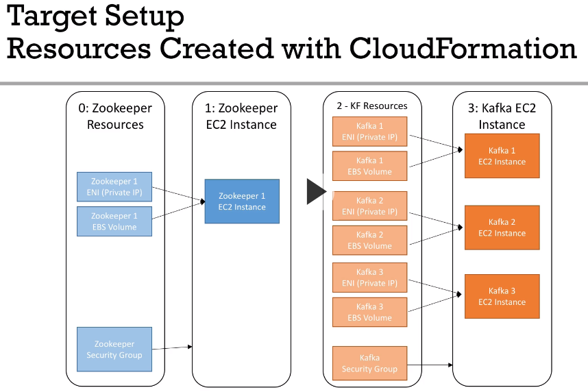
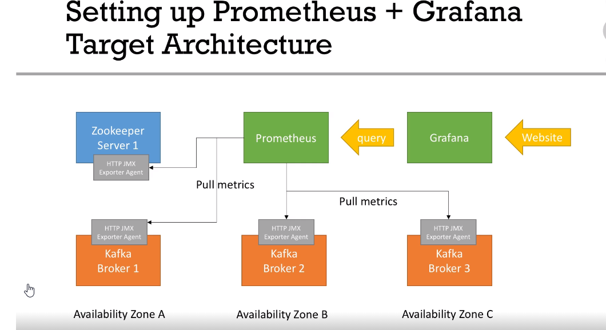

# Apache Kafka Series - Kafka Monitoring and Operations
auth: Stephanee Maarek
(5h)
Course Level: Expert
Audience:  kafka admins, architects, devops
code repo:
https://github.com/PacktPublishing/Apache-Kafka-Series---Kafka-Monitoring-and-Operations
(extract code under ref)

## Plan 
* ch1 Overview  (7m)
* ch2 kafka quick setup in aws (50 m)
* ch3 kafka admin setup (42 m)
* ch4 kafka monitoring setup : grafana + prometheus (78 min)
* ch5 kafka operations (120 min)
* ch6 kafka cluster upgrade (25 m)
* ch7 next steps (4m)

## ch1 Intro
Kafka on aws 5 ec2  instances 

### admin tools:
*  zooNavigator ui (for zookeeper)
*  yahoo kafka manager (for brokers)
* linkedin kafka monitor  (ui to visualize producer/consumer and measure end-to-end latency)

#### monitoring tools:
* prometheus: acquire + store metrics
* grafana: create dashboards to  viz metrics

#### Operations learning:
* roll restart of kafka brokers 
* update brokers conf in a safe way
* increase decrease replication factor
* add a broker to kafka cluster
* service and replace a broker in a kafka cluster
* remove a broker in a kafka cluster
* install CLI tools to automate workflows

## ch2 kafka quick setup
Setup kafka using  Cloud formation. 
Cloud formation is a declarative way to provision aws resources. 

### target infra
subnet AZ-A  , sbunet AZ-B  , subnet AZ-C in  3 availability zones
AZ-A (zookeeper + broker 1), AZ-B (broker2)  AZ-C(broker)

Zookeper
* Zoookeeper resources { ENI (private IP), EBS Volume, Security Group }
* Zooker EC2 Instance
* KF resources
* Kafka EC2 Instance

#### Cloud formation target setup
4 CloudFormation  templates


NB! kafka brokers run  version 1.1.1  .  later in the course  upgrade to 2.0.0

NB! serparate IP and EBS volumes from EC2 instances to be able to delete EC2 without using data or ip addresses

Setup SSH Keys in AWS 

#### deploy zoookeper using cloudformation
aws service cloud formation 

**create stack 0**
* upload template to amazon s3  : 0-zk-fixed-resources.yml
* for the default ip  172.31.9.21 select the matching  subnet 172.31.0.0/20  (VPC service )
	* the mask /20 is 255.255.240.0 and wildcard mask: 0.0.15.255
* hit next and create stack
* see events and resources as they are updated  

aws Ec2 service
* _security group_ for zookeper (refresh ec2 dashbaord: newrok and security)
* obseve ports  { 2888, 8080, 9999, 22, 3888, 8778, 2181}
* _network interface_ (for the  zookeeper ip  172.31.9.21)
* _elastic block Store Volume_   default volume of 8 gib

everything is in the expected frankfurt zone

**create stack 1**
file: 1-zookeeper.yml   this is for zookeeper ec2 instance creation 
* name zk-compute
* instance type t2.micro
*  for ec2 keyPair  first  create one in Ec2 console : Network : Key Pairs named KafkaMonitoringCourse   a pem ssh key file will be downloaded
* potentially disable rollback

**create stack 2**
file: 2-kafka-fixed-resources.yml
name: kafka-resources
* kafka1   in the same subnet as zookeeper entery ip 172.31.1.31
* google cidr to ip  to check available IPs for the given cidr mask such as 172.31.0.0/20
	* https://www.ipaddressguide.com/cidr
* kafka 2  create in  zone eu-central-1a  (this corresponds to subnet  172.31.16.0/20), give it ip addresse 172.31.17.32
* kafka 3 careate on zone eu-central-1b  (cidr: 172.31.32.0/20), give it ip 172.31.33.33
* kafka 4  let create = false,  put  IP : 172.31.1.34

this creates kafka security group, network interfaces , ebs volumes

** create stack 3**
file: 3-kafka.yml
name: kafka-compute
*  use keyname KafkaMonitoringCourse


#### sshing into the kafka machines
NB! if machines will be stoped when restarted their public ip will be changed
move the pem file and run chmod 400 on it
ssh into the box using its current public IP
```
ssh -i ~/.ssh/pems/KafkaMonitoringCourse.pem  ec2-user@18.192.205.189
```
check that zookeeper service is running
```
sudo systemctl status zookeeper
```
to start or stop the service
`sudo systemctl stop|start zookeeper`

to see zookeeper journal
```
journalctl -u zookeeper
```

!NB on zookeeper host needed to update file /usr/local/bin/setup_kafka_bin  to change  kafka download url
```
wget -P /home/ec2-user https://archive.apache.org/dist/kafka/1.1.1/kafka_2.12-1.1.1.tgz
```
then run it and  rerun   /usr/local/bin/add_to_bash_profile ,  then `sudo /usr/local/bin/start_zookeeper`

#### stop start  kafka cluster
* stop all 4 ec2 instances at once in ec2 dashboard
* start first only zookeeper instance , ssh  and check zookeeper service, then start 3 kafka brokers, ssh and check that kafka service is running

#### create test topic
```
kafka-topics.sh --zookeeper 172.31.9.21:2181 --topic dummy_topic --create --replication-factor=3 --partitions 12

kafka-topics --zookeeper 172.31.9.21:2181 --list

#producer messages
kafka-console-producer.sh --broker-list localhost:9092 --topic dummy_topic

>msg1
>msg2
>
Ctrl-c

#consume messages
kafka-console-consumer.sh --bootstrap-server 172.31.1.31:9092,172.31.17.32:9092,172.31.33.33:9092 --topic dummy_topic --from-beginning
```
## ch3 Kafka Administration setup
Zoonavigator, Kafka Manager, Kafka Monitor

#### create ec2 linux 2
* EC2 -> Launch Intance
* select amazon linux 2 AMI , type t2.micro  (select medium for production) , click continue instance details
* select subnet eu-central-1b,  click next add storage
* select default 8GB disk,  click next: tags
* add tag Name: Administration Machine, click next: configure security group
* create new group  named: administration-sg, keep 1 rule for ssh, click review and Launch
* click Launch, select KafkaMonitoringCourse key, click Launch Instance

#### now ssh into the newly created instance 
Check file /code/0-basic-admin-tools/systemd/admin-setup.sh

It shows how to install docker and docker-compose on aws linux 2

Execute its commands in a newly created ec2 instance

#### launch zoonavigator in a docker , configure it as systemd service
* copy 0-basic-admin-tools/docker-compose/zoonavigator.yml  to the ec2  instance
* launch docker-compose -f zoonavigator.yml
* in ec2 admin machine security group add port 7070  and then in the browser go to ec2_admin_machine_ip:7070
* in the connection string  put the zookeper's  private_ip:port i.e.  172.31.9.21:2181
* setup zoomnavigator docker compose as a systemD service (check comands in admin-setup.sh)
* copy file from 0-basic-admin-tools/systemd/docker-compose@service  to /etc/systemd/system/docker-compose@.service
* copy  0-basic-admin-tools/docker-compose/zoonavigator.yml  to /etc/docker/compose/zoonavigator/docker-compose.yml
* `sudo systemctl start docker-compose@zoonavigator`
* `sudo systemctl status docker-compose@zoonavigator`

#### Kafka Manager UI, configure as systemd service
based on  https://github.com/hleb-albau/kafka-manager-docker
follow the commands in admin-setup.sh  in section #Install kafka manager as systemd

#### install kafka-monitor
google kafka-monitor linkedin

We will build this project from its github repo  using gradlew
**NB! for kafka 1.1 switch to repo branch branch 1.1.x**
follow the commands in admin-setup.sh  in section #Install kafka monitor as systemd
after the project is built  modify the file  config/kafka-monitor.properties  to set correct  zookeeper and broker ips and ports.

## ch4 kafka monitoring setup grafana + prometheus
* kafka is indepedent from your monitoring stack
* kafka exposes metrics using J MX
* this course uses prometheus and grafana, but the idea remains the same for whicher tool used
* 
Other alternatieve tools
* Self-monitoring
	* ELK (elasticsearch + kibana) can be used,  Confluent control center (paid monitoring tool by Cofluent)
	* Linkedin Cruise Control (no UI, automated monitoring)
*  manageed monitoring
	* Datadog
	* NewRelic
	* Splunk
	* CloudWatch Monitoring (requires a lot of work (maarek))

Below is the target architecture schema



### install premetheus and jmx exporters

https://prometheus.io
google prometheus java jmx exporter agent
https://github.com/prometheus/jmx_exporter

##### instaling prometheus 
1. as java agent on kafka brokers
follow instruction in file 1-promoethus-grafana/0-setup-kafka-prometheus-agent.sh
perform the instructions on kafka brokers
!NB for the moment install the jars version as in course, not the latest ones
test the prometheus metrics
`curl localhost:8080`

2. as  software on admin machine
The prometheus metrics from kafka brokers are accessible on the admin machine
`admin>  curl 172.31.1.31:8080`
follow the section "admin machine " in the file 0-setup-kafka-premetheus-agent.sh

In prometheus folder create  prometheus.yml  based  on file 1-promotheus-grafana/prometheus/promethus.yml, specify there  ips of the brokers and zookeepr

cp  1-promotheus-grafana/systemd/prometheus.service to  /etc/systemd/system/prometheus.service

3. install prometheus java agent on kafk2 and kafka3
update prometheus.yml  on admin machine to include kafka2 and kafka3

now  in prometheus web ui execute a given metric then you see metrics coming from all 3 brokers

4. install prometheus jar  on zookeeper
	* follow the same prometheus jar install instructions as for kafka hosts. 
	* download zookeeper.yaml from https://github.com/prometheus/jmx_exporter/tree/master/example_configs
	* add EXTRA_ARGS line in /etc/systemd/system/zookeeper.service
	* reload  systemctl daemon-reload, restart zookeeper service
	* on admin machine update prometheus.yml config  uncomment the  job_name: 'zookeeper'  and restart the prometheus service


!NB  Open Monitoring with AWS MSK is supported  ref:
https://docs.aws.amazon.com/msk/latest/developerguide/open-monitoring.html

On Admin machine restart  the prometheus service

#### setup grafana
follow instructions in 1-promotheus-grafana/1-setup-grafana.sh

in grafana.ini chang the anonymous Auth settings to addlow admin access as admin

enable grafana as systemd service

#### create grafana dashboards
google grafana dashboard kafka
https://grafana.com/grafana/dashboards/721

in datasources setup prometheus  localhost datasource

in grafana admin import this dashboard

### Important jmx metrics to monitor
Few metrics are super important to have
* Number of active controller: should always be 1
* Number of Under Replcated Partitions: should alwas be 0
* Number of Offline Partitions:  should alwyas be 0

google kafka documentation
https://kafka.apache.org/documentation/#monitoring

google kafka monitoring confluent documentation
https://docs.confluent.io/4.0.0/kafka/monitoring.html

**adding additional panel to our kafka dashboard**
duplicate bytes i per topic
create bytes in per broker by modifying metrics formula to 
`sum without(topic)(rate(kafka_server_brokertopicmetrics_bytesin_total{job="kafka",topic!=""}[5m]))`

save the Kafka Overvew board


