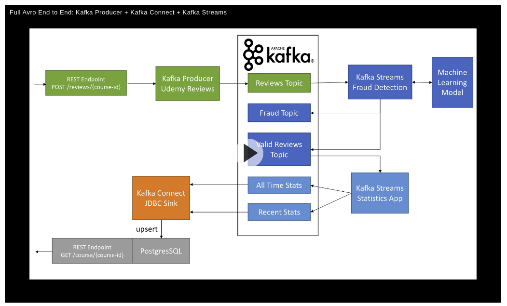

# Apache Kafka Series Confluent Schema Registry and REST Proxy

4.18 hrs

##Plan

* ch1 Intro 15m
* ch2 avro schemas ( 32 m)
* ch3 avro in java  (60m)
* ch4 setup and launch kafka (25 m)
* ch5 confluent schema registry and kafka (55m)
* ch6 confluent rest proxy (38 m)
* ch7 annexes  full avro end 2 end (22m)
*

## ch1 Intro
15 m - 20m factor. 1
problem. Kafka processes bytes
If data format changes, consumers will break

* we need data to be self describble
* we need schemas and schema registry
* kafka is not responsible to validate data. so it is fast.

Solution:  Schema registry needs to be a separate components
* producers, consumers need to talk about it

## ch2 Avro schemas
32 m 20:30  - 21:35   factor 2. 

`code/0-avro-schemas`
avro record has always, type, namespace, name, doc and each field  has name, type and doc. 

#### primitive types

* null
* boolean
* int (32-bit integer)
* long (64 bit iteger)
* float (32 bit single prec floating point number)
* double (64 bit double prec. floating point number)
* bytes  (sequence of 8-bit bytes)
* string  (unicode character sequence)

__first avro record schema__

`code/0-avro-schemas/1-customer-solution.avsc` 

```json
{
  "type": "record",
  "namespace": "com.example",
  "name": "Customer",
  "doc": "Avro Schema for our Customer",     
  "fields": [
    { "name": "first_name", "type": "string", "doc": "First Name of Customer" },
    { "name": "last_name", "type": "string", "doc": "Last Name of Customer" },
    { "name": "age", "type": "int", "doc": "Age at the time of registration" },
    { "name": "height", "type": "float", "doc": "Height at the time of registration in cm" },
    { "name": "weight", "type": "float", "doc": "Weight at the time of registration in kg" },
    { "name": "automated_email", "type": "boolean", "default": true, "doc": "Field indicating if the user is enrolled in marketing emails" }
  ]
}
```


#### complex types 

* Enums

  * enumerated  e.g.  status {bronze, Silver, Gold}
    * `{"type": "enum", "name": "cli_seat", "symbols": ["first", "biz", "econ"]}`

* Arrays
	
	* `{"type": "array", "name": "cli_emails" , "items": "string"}`
	
* Maps
	* key-value pairs
		* `{"type": "map", "name": "form_answers" , "values": "string"}`
* Unions
	* can allow a field to take different types
	* common usage is for optional values
	* `{name": "middle_name" ,  "type": ["null","string"], "default":null}`  NB no quotes around  default value null
	
* Calling other schemas as types (see example just below)

`code/0-avro-schemas/1-customer-solution.avsc` is a more complex schema with complex fielsd CustomerAdress

```json
[
  {
    "type": "record",
    "namespace": "com.example",
    "name": "CustomerAddress",
    "fields": [
      { "name": "address", "type": "string" },
      { "name": "city", "type": "string" },
      { "name": "postcode", "type": ["string", "int"] },
      { "name": "type", "type": "enum", "symbols": ["PO BOX", "RESIDENTIAL", "ENTERPRISE"] }
    ]
  },
  {
    "type": "record",
    "namespace": "com.example",
    "name": "Customer",
    "fields": [
      { "name": "first_name", "type": "string" },
      { "name": "middle_name", "type": ["null", "string"], "default": null },       
      { "name": "last_name", "type": "string" },
      { "name": "age", "type": "int" },
      { "name": "height", "type": "float" },
      { "name": "weight", "type": "float" },
      { "name": "automated_email", "type": "boolean", "default": true },
      { "name": "customer_emails", "type": "array", "items": "string", "default": []},
      { "name": "customer_address", "type": "com.example.CustomerAddress" }
    ]
}]
```

#### Logical Types
These give moe meaning to existing primitive types 
* decimals (bytes)
* date (int)
* time-millis (long  numb of milleseconds after midnight)
* timestamp-millis (long    number of millesecons since  unix epoch)

`{"name:"signup_ts", "type": "long", "logicalType": "timestamp-millis"}`
NB! logical types are new, not yet supported by all languages, don't play well with unions. Be careful. 

example:
`code/0-avro-schemas/3-customer-timestamp.avsc
```json
[
  {
    "type": "record",
    "namespace": "com.example",
    "name": "CustomerAddress",
    "fields": [
      { "name": "address", "type": "string" },
      { "name": "city", "type": "string" },
      { "name": "postcode", "type": ["string", "int"] },
      { "name": "type", "type": "enum", "symbols": ["PO BOX", "RESIDENTIAL", "ENTERPRISE"] }
    ]
  },
  {
    "type": "record",
    "namespace": "com.example",
    "name": "Customer",
    "fields": [
      { "name": "first_name", "type": "string" },
      { "name": "last_name", "type": "string" },
      { "name": "age", "type": "int" },
      { "name": "height", "type": "float" },
      { "name": "weight", "type": "float" },
      { "name": "automated_email", "type": "boolean", "default": true },
      { "name": "customer_emails", "type": "array", "items": "string", "default": []},
      { "name": "customer_address", "type": "com.example.CustomerAddress" },
      { "name": "signup_ts", "type": "long", "logicalType": "timestamp-millis", "doc": "EPOCH millis Timestamp at which the user signed up "}
    ]
}]
```

####  complex case of decimals
in computer floats and doubles are floating binary point types.  e.g.  they represent numbers e.g. `10001.10010110011`
for scientific computations use Floats and Doubles  (imprecise computations)
For money use decimal.  (need for exactly accurate result) 
Avro has a non-intuitive way to store decimals ( bytes is underlying type)
Avro lib for java did not implement it right for thest type

Advising agains using Decimals as a logical type  till the framework matures
For now  use "string" to represent the decimal value. Easy for printing, easy to parse and understand.

## ch3 Avro in Java
24:00 02:00  factor  2

primary support of avro in Java

__Generic Record__
demo project:
`maarek-schema-registry-avro/szi/kafka-avro-course/avro-examples`

class `com.github.simplesteph.avro.generic.GenericRecordExamples`  
read, write generic records to avro file, from avro file with schema defined in code. 

__Specific Record__
using avro schema. Same project
`maarek-schema-registry-avro/szi/kafka-avro-course/avro-examples`
create a file resources/avro/customer.avsc   from code/0-avro-schemas/1-customer-solution.avsc

in project `avro-examples/pom.xml`  check configuration for a plugin `avro-maven-plugin`.
It is also necessary to have a configuration for a plugin `build-helper-maven-plugin`
especially `<source>target/generated-sources/avro</source>`

do `mvn clean package`  to see  appear  `target/generated-sources/avro/com.example.Customer`  as specified in  customer.avsc

NB `target/generated-sources/avro` is specified as source folder in intellij module 

class `com.github.simplesteph.avro.specific.SpecificRecordExamples` to read write  to avro files.  `CustomerBuilder has now attributes methods`

with kafka the scenario is 
```
|in java create avro obj| -> write avro bytes to |kafka + schema registry| -> read avro bytes -> |use java to read an avro object|
```
__Avro Tools__
created 2 scripts bin ~/bin/avro-showdata.sh  ~/bin/avro-getschema.sh

__Record by  Reflection__
from a pojto to avro schema via reflection

package `com.github.simplesteph.avro.reflection`
class `ReflectedCustomer` is a Pojo
class `ReflectionExamples`  write,read avro  from a ReflectedCustomer class

### schema evolution
4 evolultions
* backward:  when new schema can be used to read old daa
* forward  :when old schema ca be used to read new data
* full : both backward and forward (desirable target)
* breaking:  none of the above

Full compatible:
* only add fields with defaults
* only remove fields that  have defaults	

class `com.github.simplesteph.avro.evolution.SchemaEvolutionExamples`
write and read avro  between V1 and V2 schemas

## ch4 Kafka in Docker 

`code/2-start-kafka/docker-compose.yml`  filres the landoop/fast-data-dev image
available on http://localhost:3030

install confluent in  /opt/sft

or run a docker image
`docker run -it --rm --net=host confluentinc/cp-schema-registry:3.3.1 bash`
Then in the docker container you can do 
`kafka-avro-console-consumer`

## ch5 Confluent Schema Registry and Kafka

Centralized place to store all schemas
Project by Confluent

* add schema
* retrieve schema
* update schema
* delete schema
All this throuh a REST API
Schemas applied to key  and/or values

demo Landoop UI  
Schema Registry Enter
* new Schema.  ${topic-name}-key|value
* create new schema CustomerTest
* edit schema by adding new field "last_name"
	* Evolve the schema

demo `code/2-schema-registry/1-kafka-avro-console-producer-consumer.sh`
run docker container and connect to it
```
docker run --net=host -it confluentinc/cp-schema-registry:3.3.0 bash
```
the following registers a new schema and puts 2 messages in a created test-avro topic
```
kafka-avro-console-producer \
     --broker-list 127.0.0.1:9092 --topic test-avro \
     --property schema.registry.url=http://127.0.0.1:8081 \
     --property value.schema='{"type":"record","name":"myrecord","fields":[{"name":"f1","type":"string"}]}'
{"f1":"value1"}
{"f1":"value2"}
```
if you put data in uexpected format eg. `{"f2":"value_xx"}` or `{"f1", 10.00} ` an exception is raised
I.e. Avro cosole producer will push a message only with expected format

now consume messages in avro consumer:  It will consume only messages with expected format
```
kafka-avro-console-consumer --topic test-avro \
    --bootstrap-server 127.0.0.1:9092 \
    --property schema.registry.url=http://127.0.0.1:8081 \
    --from-beginning
```

For the same topic you can only paste a schema change compatible with an exsisting schema registered for that topic

i.e.  the following is **not** valid (change of type for the same field)
```
kafka-avro-console-producer \
    --broker-list localhost:9092 --topic test-avro \
    --property schema.registry.url=http://127.0.0.1:8081 \
    --property value.schema='{"type":"int"}'
```
the following schema evolution is valid
```
kafka-avro-console-producer \
    --broker-list localhost:9092 --topic test-avro \
    --property schema.registry.url=http://127.0.0.1:8081 \
    --property value.schema='{"type":"record","name":"myrecord","fields":[{"name":"f1","type":"string"},{"name": "f2", "type": "int", "default": 0}]}'

{"f1":"value4", "f2":10}
{"f1":"value5", "f2":11}
```

running the kafka-avro-console-consumer  will read all messages in 2 evolving formats

Demo `writing avro producer in Java` mvn    maven project module `kafka-avro-v1`

Demo `writing messaes with evolving schema in Java` maven project module `kafka-avro-v2`

## ch6 confluent rest proxy 
factor 5

Lucid diagram for kafka schema registry

HTTP :  has a performance hit of factor 3, 4 cmpared to kafka native protocol
Rest proxy: use V2 api
HTTP Content type is:

```
application./vnd.kafka.[json|binary|avro].[v1|v2]+[json]
#ie
application./vnd.kafka.avro.v2+json
```
Donwload clieant from insomnia.rest
import insomnia requsts from  `code/4-test-proxy`   
* Topic Operations
* Producers
	* Producer Binary
		* binary data has to be base64 encoded. 
		* Heades vales are important
* Consumers
	* Consumer Binary
	* create, subscribe consume ,commit offsets
		* after offset is commited, you wil not get messages with ids lower than a commited offset.

**Expected Scenario** in data consumption:
* create consumer
* subscribe the consumer
* consume data
* commit offsets
* delete the consumer

#### producing consuming json data
Producers : Produce JSON
Consumers : JSON

#### producing consuming avro
Producers Produce Avro
	* Produce Avro
	* Copy to Produce Avro Alt "value_schema" -> "value_schema_id"

Consumers:  AVRO
launch kafka-avro-console-consumer

```
/opt/sft/confluent-5.5.0/bin/kafka-avro-console-consumer  --bootstrap-server localhost:9092 --property schema.registry.url=http://127.0.0.1:8081 --topic rest-avro --from-beginning
```
repeat the create consumer avro , subscribe, consume, commit, delete consumer avro   cycle   
## ch7 Annex  full avro end to end 

medium article: 
https://medium.com/@stephane.maarek/how-to-use-apache-kafka-to-transform-a-batch-pipeline-into-a-real-time-one-831b48a6ad85

github repo:
https://github.com/simplesteph/medium-blog-kafka-udemy

checkout code: follow instructions inn `run.sh`

demo diagram



## Kafka Rest Proxy Installation and Scaling

to install rest proxy in prod , go through the doc

https://docs.confluent.io/current/kafka-rest/config.html